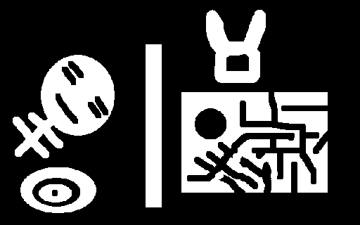
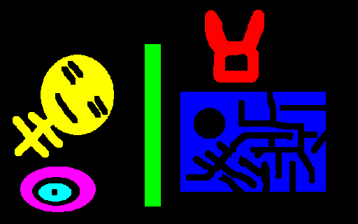
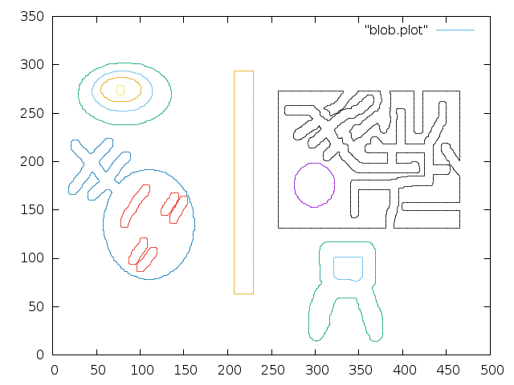

# blob - a 8-neighbour connected components labelling and contours extractor.

See `blob.h` for a complete documentation.

## Reference ##
"A linear-time component-labeling algorithm using contour tracing technique"
 by Fu Chang, Chun-Jen Chen, and Chi-Jen Lu.

## Example ##
The `test` directory contains the source code of a small program that generates an image of the label buffer as long as a JSON file and a GNUplot data file containing the set of extracted contours.

#### source

#### label
 
#### contours
 

Image reading and writing libraries [stb_image.h, stb_image_write.h](https://github.com/nothings/stb/) by Sean Barrett (public domain).

## Build ##

A CMake configuration file is provided in order to build a static library and
the associated documentation.
A typical usage of CMake may be:
```bash
mkdir build
cd build
cmake ..
make
```
On a Linux system, the Makefile will generate a static library `libblob.a`. 

`make doc` will generate the documentation with [DoxyGen](http://www.stack.nl/~dimitri/doxygen/).

## License ##
`blob` is licensed under the MIT License, see LICENSE for more information.
